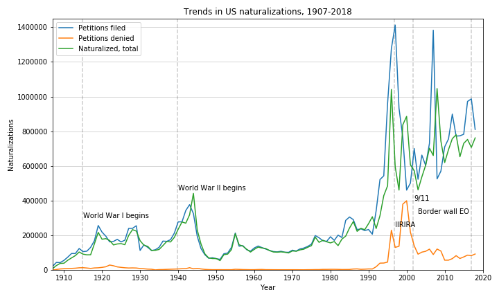

# immigration_analysis_project
This project analyzed immigration data to answer the question, "Do major events and government policy negatively affect citation rates, especially from certain demographics?"

We wanted to understand:

* Are there changes in immigration trends over time based on nationality, age, and immigration status (i.e. lawful permanent resident, asylum seeker, or petition filed for naturalization)?
* How have major events like 9/11 or the Trump "border wall" executive order affected immigration rates, especially among immigrants from predominantly Muslim countries and Latin America?
* What can we learn about the history of immigration of America, from looking at the data?

## Our findings

### Lawful permanent resident rates, 1823 - 2018

### Naturalization rates, 1907 - 2018

### 9/11 affected immigration rates from predominantly Muslim countries, but not how you'd expect.

We found statistically significant differences in the pre- and post-9/11 naturalization numbers for Afghan, Iranian, Syrian, and Saudi Arabian immigrants. We tried to account for the time-lag in immigration by sampling for 4-5 years following 9/11, rather than immediately following. Interestingly, though the number of naturalizations for Iranian immigrants dropped substantially, numbers for Saudi Arabians increased.

We found statistically significant differences for lawful permanent resident rates between immigrants from Islamic countries and Central American countries after 9/11. Even though the number of immigrants from Islamic countries slightly increased as compared to pre 9/11, the rate of increase is less than for Central Americans.

### Similarly, the Trump border wall affected immigration rates from Latin American countries, but not how you'd expect.

We found statistically significant differences for naturalization rates of Mexican, Guatemalan, and Honduran immigrants during the years immediately preceding and following the signing of the Trump "border wall" executive order. Surprisingly, these rates actually increased, rather than decreased, for Mexican and Honduran immigrants. Guatemalan naturalizations appear to stay roughly the same over time. However, the overall number of petitions filed dropped significantly in 2017, likely due to the success of deterrent policies like the "border wall" executive order.

These results should be interpreted carefully—naturalization is a process that takes time, and the individuals who were naturalized in 2017 and 2018 likely had been in the process of naturalization for months if not years before the EO was signed.

### Policies like the Immigration Act of 1907 and IIRIA (1996) arguably had a larger affect on immigration than 9/11 and Trump-era policies.

1907 saw the lowest number of petitions filed and denied and naturalizations. There were very restrictive immigration policies in place prior to 1907, particularly related to specific nationalities. The Immigration Act of 1907 paved the way for increases in overall immigration numbers over time.

Towards the start of the 21st century, we see a spike in the number of petitions denied, likely due to the introduction of a restrictive law called [IIRIRA](https://en.wikipedia.org/wiki/Illegal_Immigration_Reform_and_Immigrant_Responsibility_Act_of_1996) during the Clinton years. The difference in the overall number of petitions filed through the years directly preceding and following the implementation of IIRIA is statistically significant. This fact, interpreted alongside the above graphs, suggests that IIRIA directly affected the number of petitions filed in the years following the passing of the Act.

### State migration trends

#### 2000

#### 2018

Based on a 2000 and 2018 comparison, California, New York, Florida, Texas and New Jersey were top 5 immigrants destinations. This order didn't change between 2000 and 2018. In 2000, 62% of immigrants moved to one of top 5 states. In 2018, 57% of immigrants moved to one of top 5 states, suggesting that immigrants were immigrating to non-top 5 states.

### Demographic differences observed among lawful permanent residents and asylum seekers, 2009 vs 2018

We did not test for statistical significance between these samples, as we were uncertain of the independence of these groups (e.g. one can be both an LPR and an asylum seeker at the same time).

#### Age

The number of 21+ year olds seeking Asylum increased by nearly 20% between 2009 and 2018.

#### Sex

The sex ratio of lawful permanent resident is largely equal.

#### Marital Status

### Other observations

* 1823: Lowest # LPRs (~6k)
* 1991: Peak in LPRs (~1.8M)
* 1997: Peak in naturalizations
* 1997+: Unexpected growth in rejected naturalization applications (IIRIA)
* Growth in overall proportion of immigrants from 6% (1950) to 13% (2017) - this was much smaller than we expected, and from what political discourse would lead you to believe
* Mexico has the highest number of LPRs in last 30 years (6.2M)
* Maldives has lowest number of immigrants in same time frame (121)

## References

* United States. Department of Homeland Security. Yearbook of Immigration Statistics: 2018. Washington,  D.C.: U.S. Department of Homeland Security, Office of Immigration Statistics, 2018
* United States. Department of Homeland Security. Yearbook of Immigration Statistics: 2009. Washington,  D.C.: U.S. Department of Homeland Security, Office of Immigration Statistics, 2009
* United States. Department of Homeland Security. Yearbook of Immigration Statistics: 1999. Washington,  D.C.: U.S. Department of Homeland Security, Office of Immigration Statistics, 1999
* United Nations Population Fund dashboard. https://www.unfpa.org/data/world-population-dashboard
* Migration Policy Institute. Migration Policy Institute Data Hub. http://www.migrationpolicy.org/programs/data-hub
